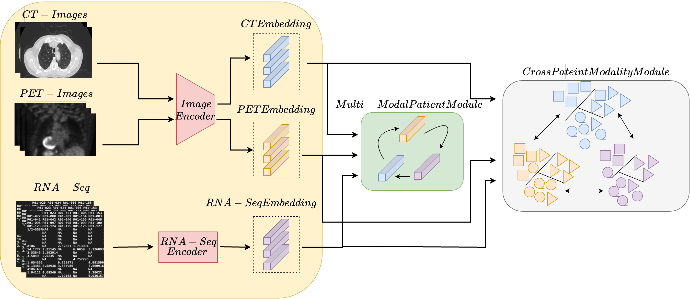

<div align="center">

# Survival Prediction in Lung Cancer Through Multi-Modal Representation Learning
### Winter Conference on Applications of Computer Vision (WACV), 2025

[](https://arxiv.org/abs/2409.20179)
[](#)
[](https://www.python.org/)
[](https://pytorch.org/)
[](#license)

📄 **Paper:** [Paper](https://arxiv.org/abs/2409.20179)
</div>

---

<p align="center">
  
</p>

The approach combines CT, PET, and genomics with self-supervised modality representations and cross-patient learning for non-small-cell lung-cancer survival prediction.

---

## Table of Contents

- [Highlights](#highlights)
- [Method Overview](#method-overview)
- [Installation](#installation)
- [Dataset](#dataset)
- [Repository Structure](#repository-structure)
- [Quickstart](#quickstart)
- [Training and Evaluation](#training-and-evaluation)
- [Results](#results)
- [Citation](#citation)
- [Acknowledgements](#acknowledgements)
- [License](#license)
- [Contact](#contact)

## Highlights

- Paper metadata, a teaser figure, and a ready-to-cite BibTeX entry are included.
- The repository is organized for configurations, data preparation, models,
  scripts, notebooks, and results.
- No clinical data, checkpoints, or source implementation are included yet.

## Architecture

This project will implement the method described in the associated publication:
The approach combines CT, PET, and genomics with self-supervised modality representations and cross-patient learning for non-small-cell lung-cancer survival prediction.


> The current figure is the project teaser. A detailed architecture diagram will
> be added with the public implementation.

---

## Installation

```bash
git clone https://github.com/aimanfarooqwani/lung-cancer-multimodal-survival.git
cd lung-cancer-multimodal-survival
```

Dependency and environment instructions will be added with the implementation.

---

## Dataset

This repository does not redistribute clinical images, reports, annotations, or
other protected data. Dataset access, preprocessing, and expected local paths
will be documented when the training pipeline is released.

---

## Repository Structure

```text
lung-cancer-multimodal-survival/
├── assets/       # Teaser figures and project media
├── configs/      # Experiment configurations
├── data_store/   # Local caches and derived data (not tracked)
├── dataset/      # Dataset loaders and manifests
├── model/        # Model components
├── notebooks/    # Exploratory and inference notebooks
├── results/      # Evaluation outputs and figures
└── scripts/      # Training and evaluation commands
```

---

## Quickstart

No runnable entry point has been released yet. This section will contain a
minimal inference example once the implementation is added.

---

## Training and Evaluation

Training and evaluation scripts will be added with reproducible configuration
files and metric definitions.

---

## Results

Quantitative and qualitative results will be added after the public
implementation is released.

---

## Citation

If you use this work, please cite:

```bibtex
@inproceedings{farooq2025lung,
  title={Survival Prediction in Lung Cancer Through Multi-Modal Representation Learning},
  author={Farooq, Aiman and Mishra, Deepak and Chaudhury, Santanu},
  booktitle={Winter Conference on Applications of Computer Vision},
  year={2025},
  url={https://arxiv.org/abs/2409.20179}
}
```

---

## Acknowledgements

The project will acknowledge the relevant datasets, collaborators, and
supporting institutions when the implementation is released.

---

## License

License to be determined.

---

## Contact

For questions, open a GitHub Issue or contact
[Aiman Farooq](https://github.com/aimanfarooqwani).
